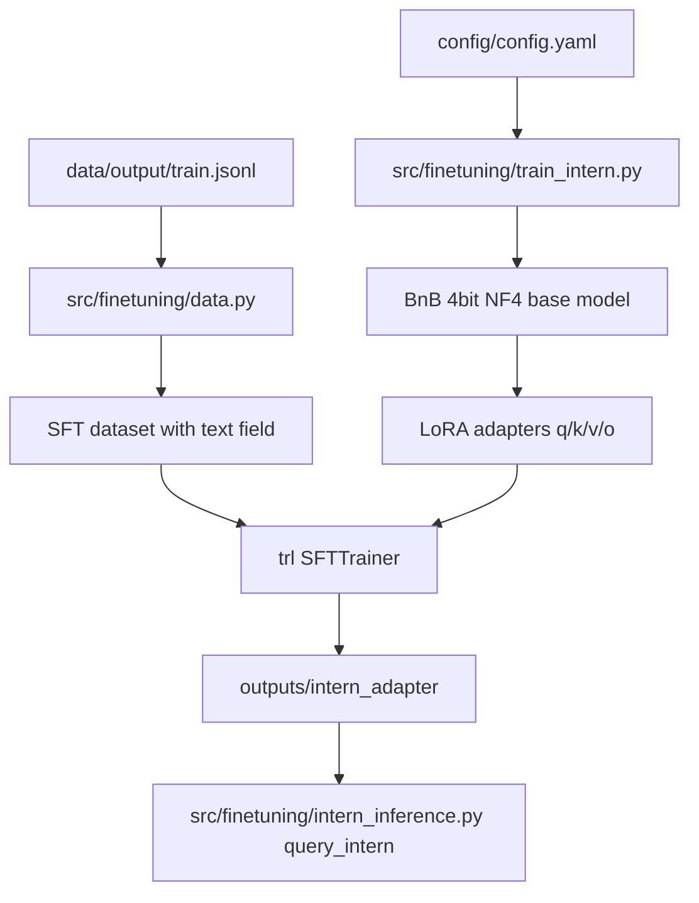

# Fine-tune “The Intern” (QLoRA + TRL)

## Fit to current repo

- **Config-driven**: Reuse [`config/config.yaml`](config/config.yaml)’s existing `finetuning:` block (already includes Llama-3-8B-Instruct, NF4+double-quant, LoRA target modules, and `min_steps: 100`).
- **Data source**: Train from your existing JSONL dataset at [`data/output/train.jsonl`](data/output/train.jsonl) (fields include `question`, `answer`, `chunk_text`, etc.).
- **Code style**: Follow the current `src/*` layout and patterns used in `src/utils/config_loader.py` + ingestion modules (small functions, YAML config, docstrings, type hints).

## What we’ll add/change

### New modules

- [`src/finetuning/data.py`](src/finetuning/data.py)
  - Load `data/output/train.jsonl` (and optionally `data/output/golden_test_set.jsonl` for eval) using `datasets.load_dataset("json", data_files=...)`.
  - Map each record to a **single `text` field** for SFT.
  - Build the `text` using **Llama-3 chat formatting** via `tokenizer.apply_chat_template(...)`:
    - **system**: “You are Uber’s 2024 strategy intern… tone + constraints”
    - **user**: includes the user `question` and (optionally) `chunk_text` as context
    - **assistant**: the ground-truth `answer`
  - Keep prompts short enough to respect `finetuning.training.max_seq_length` (truncate `chunk_text` or cap tokens).

- [`src/finetuning/train_intern.py`](src/finetuning/train_intern.py)
  - Load config via `src.utils.load_config`.
  - Create **4-bit quantized base model** using `BitsAndBytesConfig(load_in_4bit=True, bnb_4bit_quant_type="nf4", bnb_4bit_use_double_quant=True, bnb_4bit_compute_dtype=torch.float16)` (for **Colab T4**, use FP16).
  - Apply **LoRA** using `LoraConfig(..., target_modules=["q_proj","k_proj","v_proj","o_proj"], task_type="CAUSAL_LM")`.
  - Train with **TRL** `SFTTrainer` + `SFTConfig`.
    - Ensure **≥100 steps** by setting `max_steps = max(config.finetuning.training.min_steps, ...)`.
    - Use memory-safe knobs for T4: `gradient_checkpointing=True`, `per_device_train_batch_size=1`, adjust `gradient_accumulation_steps` to match your effective batch.
  - Save artifacts:
    - `trainer.model.save_pretrained(<adapter_dir>)` (LoRA adapters)
    - `tokenizer.save_pretrained(<adapter_dir>)`

- [`src/finetuning/intern_inference.py`](src/finetuning/intern_inference.py)
  - Provide `query_intern(question: str) -> str`.
  - Load base model with the same `BitsAndBytesConfig` (4-bit) and load adapters via `PeftModel.from_pretrained(base_model, adapter_dir)`.
  - Format prompts with the same **system/user** template used in training (but without the answer).
  - Generate and return only the assistant portion.

### Minimal config tweaks

Update [`config/config.yaml`](config/config.yaml) `finetuning:` to add/align a few operational fields:

- **Paths**: `data.train_file`, `data.eval_file` (or reuse `dataset.train_file/test_file`), and `output_dir` for adapters.
- **dtype**: set `quantization.compute_dtype: float16` for Colab T4 (current value is `bfloat16`).

### Dependency updates

Update [`pyproject.toml`](pyproject.toml) to include Hugging Face fine-tuning stack:

- `transformers`, `datasets`, `accelerate`, `peft`, `trl`, `bitsandbytes`, `safetensors`
- `torch` (Colab will provide CUDA builds; locally, installation approach may differ)

## Data / training flow

## Execution checklist (Colab T4)

- **HF auth**: `huggingface-cli login` (required for gated Llama-3 weights).
- **Train**: run `python -m src.finetuning.train_intern --config config/config.yaml` (or equivalent entrypoint we add).
- **Infer**: in a notebook or script:
  - `from src.finetuning.intern_inference import query_intern`
  - `query_intern("What is Uber’s 2024 strategy for Delivery?")`

## Validation

- Confirm training hits **≥100 optimizer steps** (logs + trainer state).
- Confirm adapter artifacts exist (e.g., `adapter_config.json`, `adapter_model.safetensors`).
- Smoke-test `query_intern()` on 3–5 questions from `data/output/golden_test_set.jsonl`.

## Notes (matching the workshop notebook)

- Use the same core pieces demonstrated in `llm finetuning full workshop - completed.ipynb`: `BitsAndBytesConfig` (NF4 + double quant), `prepare_model_for_kbit_training`, `LoraConfig`, `SFTTrainer`/`SFTConfig`, and `save_pretrained()` for adapters + tokenizer.